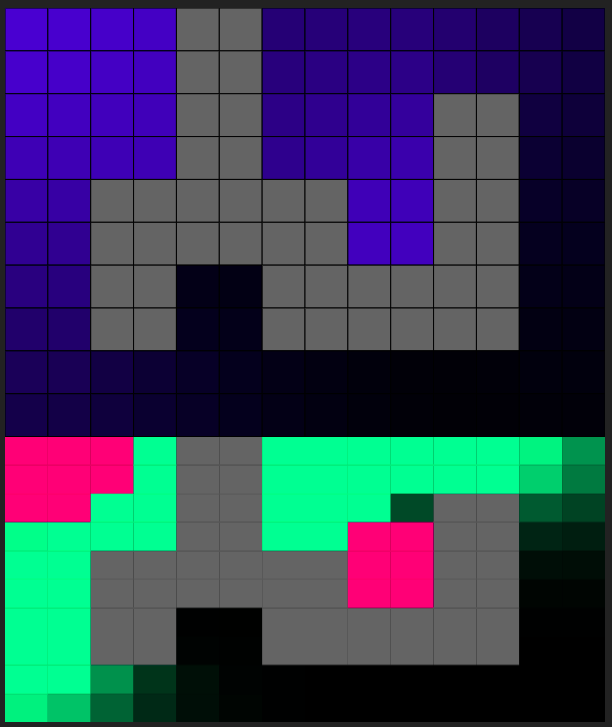

# Diffusion in 2D

Top - gas diffusion from 2 sources.  
Bottom - gas delta. Red - negative, green - positive.  

### Diffusion equation:
$$ \LARGE
\frac{\partial p}{\partial t} = D\nabla^2p
$$

where  
$\LARGE p$ - gas concentration  
$\LARGE D$ - diffusion coefficient   
$\LARGE \nabla^2$ - Laplacian operator

#### 1D case:
$$ \LARGE
\frac{\partial p}{\partial t} = D\frac{\partial^2 p}{\partial x^2}
$$

where
$\LARGE p = p(x,t)$

#### 2D case:
$$ \LARGE
\frac{\partial p}{\partial t} = D \left( \frac{\partial^2 p}{\partial x^2} + \frac{\partial^2 p}{\partial y^2} \right)
$$

where
$\LARGE p = p(x,y,t)$

### Finite Difference for discrete values:

#### 1D case:

$$ \LARGE
p_i^{next} = p_i^{prev} + D \cdot \Delta t \cdot \left( \frac{p_i^{prev} - 2p_i^{prev} + p_{i-1}^{prev}}{\Delta x^2} \right)
$$

where

$$ \LARGE
\frac {p_i^{prev} - 2p_i^{prev} + p_{i-1}^{prev}}{\Delta x^2}
$$

is a discrete 1D Laplacian,  
$\LARGE p^{0}$ - array of initial gas concentration values

_Courant-Friedrichs-Lewy (CFL)_ necessary condition for stability:

$$ \LARGE
D \frac {\Delta t} {\Delta x^2} < \frac {1}{2}
$$ 

#### 2D case:

$$ \LARGE
p_{i,j}^{next} = p_{i,j}^{prev} + D \cdot \Delta t \cdot \left( \frac{p_{i+1,j}^{prev} - 2p_{i,j}^{prev} + p_{i-1,j}^{prev}}{\Delta x^2} + \frac{p_{i,j+1}^{prev} - 2p_{i,j}^{prev} + p_{i,j-1}^{prev}}{\Delta y^2} \right)
$$

Assuming square grid ($\LARGE \Delta x = \Delta y = h$):

$$ \LARGE
p_{i,j}^{next} = p_{i,j}^{prev} + D \cdot \Delta t \cdot \frac{1}{h^2} \left(p_{i+1,j}^{prev} + p_{i-1,j}^{prev} + p_{i,j+1}^{prev} + p_{i,j-1}^{prev} - 4p_{i,j}^{prev} \right)
$$

_Courant-Friedrichs-Lewy (CFL)_ necessary condition for stability:

$$ \LARGE
D \frac {\Delta t} {\Delta x \Delta y} < \frac{1}{4}
$$ 

#### Edges:
Consider $\LARGE p_{i-1} = p_i$.

